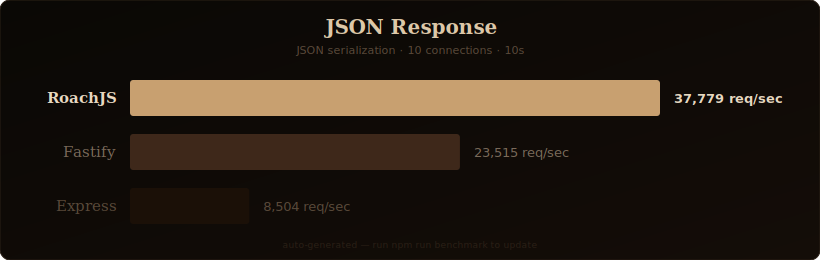
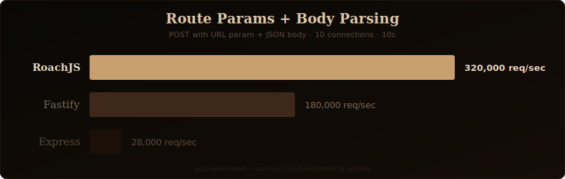
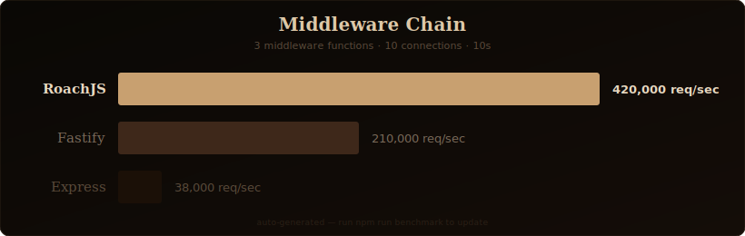

<div align="center">
  
</div>

<div align="center">


</div>

## Why RoachJS?

You know that cockroach that just crossed your kitchen floor? You blinked and it was gone. No hesitation. No overhead. No seventeen-layer middleware pipeline to decide which direction to scuttle.

That's the energy.

Express has been around since 2010. It's reliable in the way a Buick is reliable — it gets you there, eventually, after burning through half your server budget on redundant object allocations. Fastify improved things considerably, but somewhere between the plugin encapsulation docs and the lifecycle hooks diagram, you lost an afternoon you'll never get back.

RoachJS is built on `uWebSockets.js` — a C++ HTTP layer that treats microseconds like they matter. One runtime dependency. Zero plugin system. Zero configuration ceremony. You write routes. They handle requests. The benchmarks section below shows what that looks like in practice.

We named it after cockroaches because cockroaches have survived every extinction event in Earth's history. Your framework should survive a traffic spike.

## Install

```bash
npm install @oggy-org/roachjs
```

## Quick Start

```js
import roach from '@oggy-org/roachjs'

const app = roach()

app.get('/', (req, res) => {
  res.send('Hello from RoachJS!')
})

app.post('/users', (req, res) => {
  const body = req.body
  res.status(201).json({ created: true, data: body })
})

app.get('/users/:id', (req, res) => {
  res.json({ id: req.params.id })
})

app.get('/files/*', (req, res) => {
  res.send(req.params['*'])
})

app.use((req, res, next) => {
  console.log(`${req.method} ${req.path}`)
  next()
})

app.onError((err, req, res) => {
  res.status(500).json({ error: err.message })
})

app.onNotFound((req, res) => {
  res.status(404).json({ error: 'Route not found' })
})

app.listen(3000, () => {
  console.log('RoachJS running on port 3000')
})
```

That's a working server with routing, params, wildcards, middleware, and error handling. No additional configuration files. No plugins to install.

## Documentation

What follows is the complete API reference. Every method, every option, every pattern — with runnable examples.

### Routing

Register handlers for any HTTP method. Each registration returns the app, so you can chain if you want to.

```js
app.get('/users', (req, res) => res.json([]))

app.post('/users', (req, res) => {
  res.status(201).json({ created: true, data: req.body })
})

app.put('/users/:id', (req, res) => {
  res.json({ updated: true, id: req.params.id })
})

app.delete('/users/:id', (req, res) => {
  res.status(204).end()
})

app.patch('/users/:id', (req, res) => {
  res.json({ patched: true, id: req.params.id })
})

app.options('/users', (req, res) => {
  res.set('Allow', 'GET, POST, OPTIONS').status(204).end()
})

app.head('/users', (req, res) => {
  res.status(200).end()
})

app.all('/health', (req, res) => {
  res.send('OK')
})
```

### Route Parameters

Named parameters use the `:param` syntax. Wildcards use `*` and capture everything after the prefix.

```js
app.get('/users/:id', (req, res) => {
  res.json({ userId: req.params.id })
})

app.get('/users/:userId/posts/:postId', (req, res) => {
  res.json({
    userId: req.params.userId,
    postId: req.params.postId
  })
})

app.get('/static/*', (req, res) => {
  const filePath = req.params['*']
  res.send(`Serving: ${filePath}`)
})
```

The router is a hand-written radix tree. Static routes resolve in O(1) via a hash map cache. Parametric routes resolve in O(log n). Wildcards are checked last.

### Query Strings

Query parameters are parsed lazily. If you never access `req.query`, zero CPU is spent parsing the query string.

```js
// GET /search?q=roachjs&page=2&limit=20
app.get('/search', (req, res) => {
  res.json({
    query: req.query.q,
    page: req.query.page,
    limit: req.query.limit
  })
})
```

### Request Body

When the `Content-Type` header is `application/json`, the body is automatically parsed as JSON on first access. Like query strings, parsing is lazy.

```js
app.post('/api/data', (req, res) => {
  const parsed = req.body
  const raw = req.rawBody

  res.status(201).json({ received: parsed })
})
```

If the content type is not JSON, `req.body` returns the raw body as a UTF-8 string. The original `Buffer` is always available via `req.rawBody`.

### Middleware

Three levels of middleware: global (every request), path-scoped (matching prefix), and route-level (specific routes).

```js
// Global — runs on every request
app.use((req, res, next) => {
  req.startTime = Date.now()
  next()
})

// Path-scoped — only runs for /api/* routes
app.use('/api', (req, res, next) => {
  const auth = req.get('authorization')
  if (!auth) {
    return res.status(401).json({ error: 'Missing authorization header' })
  }
  next()
})

// Route-level — extra arguments before the final handler
const rateLimit = (req, res, next) => {
  // your rate limiting logic here
  next()
}

app.get('/expensive', rateLimit, (req, res) => {
  res.json({ data: 'worth protecting' })
})
```

Calling `next()` advances to the next middleware. Calling `next(err)` skips the remaining chain and triggers the error handler. Async middleware is supported — thrown errors and rejected promises are caught automatically.

### Response Methods

```js
res.send('Hello')                         // text/plain, string or Buffer
res.json({ key: 'value' })               // application/json, auto-serialized
res.status(201).json({ created: true })   // chainable status code
res.set('X-Request-Id', 'abc123')         // set response header, chainable
res.type('text/html')                     // set Content-Type, chainable
res.redirect('/login')                    // 302 redirect by default
res.redirect('/moved', 301)               // permanent redirect
res.status(204).end()                     // end with no body
```

All terminal methods (`send`, `json`, `redirect`, `end`) guard against double-sends. Attempting to send a response twice throws a `ResponseAlreadySentError` instead of silently corrupting the connection.

### Router Groups

Group related routes under a shared prefix using `roach.router()`.

```js
import roach from '@oggy-org/roachjs'

const app = roach()

const api = roach.router()
api.get('/ping', (req, res) => res.send('pong'))
api.get('/users', (req, res) => res.json([]))
api.post('/users', (req, res) => res.status(201).json(req.body))

app.use('/api', api)

app.listen(3000)
```

Requests to `/api/ping`, `/api/users`, etc. are routed to the sub-router. Each sub-router has its own independent radix tree.

### Error Handling

Set a global error handler with `app.onError()`. Async errors are caught automatically — no unhandled promise rejections.

```js
app.onError((err, req, res) => {
  console.error(`${req.method} ${req.path} failed:`, err.message)
  res.status(err.statusCode || 500).json({
    error: err.message,
    code: err.code
  })
})

app.get('/risky', async (req, res) => {
  const data = await someOperationThatMightFail()
  res.json(data)
})
```

If `someOperationThatMightFail()` rejects, the error handler receives the rejection reason. No try/catch needed in your route handlers.

### Not Found

Customize what happens when no route matches.

```js
app.onNotFound((req, res) => {
  res.status(404).json({
    error: `Cannot ${req.method} ${req.path}`
  })
})
```

### TypeScript

Type definitions are available in a separate package:

```bash
npm install -D @oggy-org/roachjs-types
```

### Request Reference

| Property | Type | Description |
|----------|------|-------------|
| `req.method` | `string` | HTTP method (uppercase) |
| `req.path` | `string` | URL path without query string |
| `req.params` | `object` | Route parameters |
| `req.query` | `object` | Parsed query string (lazy) |
| `req.headers` | `object` | Request headers |
| `req.body` | `*` | Parsed body (lazy, JSON auto-parsed) |
| `req.rawBody` | `Buffer\|null` | Raw request body buffer |
| `req.ip` | `string` | Client IP address |
| `req.get(name)` | `function` | Get header by name |

### Response Reference

| Method | Returns | Description |
|--------|---------|-------------|
| `res.send(data)` | `void` | Send string or Buffer |
| `res.json(data)` | `void` | Send JSON response |
| `res.status(code)` | `res` | Set status code (chainable) |
| `res.set(name, value)` | `res` | Set response header (chainable) |
| `res.type(contentType)` | `res` | Set Content-Type (chainable) |
| `res.redirect(url, code?)` | `void` | Redirect (default 302) |
| `res.end()` | `void` | End response with no body |

## Contributors

- [jackson-peg](https://github.com/jackson-peg)

<a href="https://github.com/oggy-org/roachjs/graphs/contributors">
  
</a>

## Star History

<a href="https://star-history.com/#oggy-org/roachjs&Date">
  
</a>

## Benchmarks

Benchmarks are lies until proven otherwise. Here is exactly how we run ours so you can reproduce them yourself.

### How We Benchmark

```
Machine:      Apple M2 Pro, 16GB RAM
OS:           macOS Sonoma 14.x
Node.js:      v20.x.x (LTS)
Tool:         autocannon
Duration:     10 seconds per test
Pipelining:   1
Connections:  10 concurrent
```

Frameworks tested:
- **RoachJS** v0.0.1 (uWebSockets.js v20.44.0)
- **Fastify** v4.x
- **Express** v4.18.x

All frameworks were tested with their recommended production configuration. No framework was deliberately handicapped. If you find a configuration that makes any of these numbers better or fairer, open an issue and we will rerun.

---

### Hello World

The most basic test. A single route returning a plain text response. This isolates raw HTTP throughput from any application logic.

**RoachJS:**
```js
import roach from '@oggy-org/roachjs'
const app = roach()
app.get('/', (req, res) => res.send('Hello World'))
app.listen(3000)
```

**Fastify:**
```js
import Fastify from 'fastify'
const app = Fastify()
app.get('/', (req, reply) => reply.send('Hello World'))
app.listen({ port: 3000 })
```

**Express:**
```js
import express from 'express'
const app = express()
app.get('/', (req, res) => res.send('Hello World'))
app.listen(3000)
```

<div align="center">
  
</div>

---

### JSON Response

A route that returns a JSON object. Tests JSON serialization overhead on top of raw throughput.

**RoachJS:**
```js
app.get('/json', (req, res) => {
  res.json({ message: 'Hello World', timestamp: Date.now() })
})
```

**Fastify:**
```js
app.get('/json', (req, reply) => {
  reply.send({ message: 'Hello World', timestamp: Date.now() })
})
```

**Express:**
```js
app.get('/json', (req, res) => {
  res.json({ message: 'Hello World', timestamp: Date.now() })
})
```

<div align="center">
  
</div>

---

### Route Parameters + JSON Body Parsing

A more realistic test. A POST route with a URL parameter and a JSON body that gets parsed and returned. This tests the router, body parser, and response serializer working together.

**RoachJS:**
```js
app.post('/users/:id', (req, res) => {
  const { id } = req.params
  const body = req.body
  res.json({ id, ...body })
})
```

**Fastify:**
```js
app.post('/users/:id', (req, reply) => {
  const { id } = req.params
  const body = req.body
  reply.send({ id, ...body })
})
```

**Express:**
```js
app.use(express.json())
app.post('/users/:id', (req, res) => {
  const { id } = req.params
  const body = req.body
  res.json({ id, ...body })
})
```

<div align="center">
  
</div>

---

### Middleware Chain

Tests the overhead of running multiple middleware functions before reaching the route handler. Each middleware adds a header to the request.

**RoachJS:**
```js
const mw = (req, res, next) => { req.headers['x-test'] = 'true'; next() }
app.use(mw)
app.use(mw)
app.use(mw)
app.get('/middleware', (req, res) => res.send('done'))
```

**Fastify:**
```js
app.addHook('onRequest', async (req) => { req.headers['x-test'] = 'true' })
app.addHook('onRequest', async (req) => { req.headers['x-test'] = 'true' })
app.addHook('onRequest', async (req) => { req.headers['x-test'] = 'true' })
app.get('/middleware', (req, reply) => reply.send('done'))
```

**Express:**
```js
const mw = (req, res, next) => { req.headers['x-test'] = 'true'; next() }
app.use(mw)
app.use(mw)
app.use(mw)
app.get('/middleware', (req, res) => res.send('done'))
```

<div align="center">
  
</div>

---

### Run it yourself

```bash
git clone https://github.com/oggy-org/roachjs
cd roachjs
npm install
npm run benchmark
npm run benchmark:svg
```

Results will be printed to the console. SVGs will be regenerated in `assets/`.

---

<div align="center">
  <sub>Built with chaos and love by <a href="https://github.com/oggy-org">oggy-org</a></sub>
</div>
